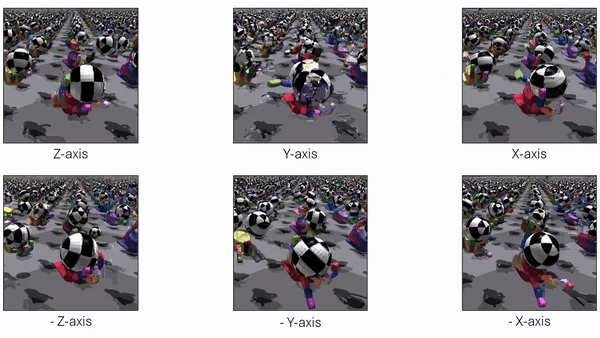

# Real-World Robotics
In this semester course, students were grouped in teams of 4/5 to design and control an anthropomorphic robotic hand. My team and I designed an ambidextrous robotic hand, characterised by a four degree of freedom thumb. This could prove useful for ambidextrous tasks by preventing the robotic arm it is attached to from having to reconfigure itself in space.

  
The robotic hand was controlled with both reinforcement learning and teleoperation. The reinforcement learning uses the PPO algorithm implemented by the open-source repository `rl_games` and IsaacGym as the simulator. This followed the work done in this [paper](https://arxiv.org/abs/2308.02453). We trained the policy on rotating a sphere about all axes.

 

The teleoperation of the hand was done using a Luxonis OAK-D Pro stereo camera and the "DepthAI Hand Tracker" deep learning algorithm to capture the positions of the joints of the user's hand. These were then mapped to the hand's joint angles to effectively move each joint and finger.

 

The highlights of the "Challenge Day", in which the hand performs reinforcement and teleoperation tasks, can be found [here](https://www.youtube.com/watch?v=-YM1Ik7tEGE&ab_channel=MatthiasJammot). More information on this project is available in the "RWR_report".

